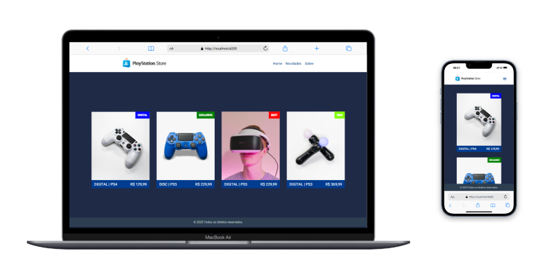

# ⚡ Projeto - Playstation Store

## 🚀 Sobre o projeto 
Bem-vindo ao projeto **PLAYSTATION STORE**, uma loja virtual!

## Pré-requisitos
Antes de iniciar, garanta que o Node.js e o npm estejam instalados em seu ambiente de desenvolvimento:

- **Node.js**: [Baixar Node.js](https://nodejs.org/)  
- **npm** (gerenciador de pacotes do Node.js): Instalado automaticamente com o Node.js.

## Tecnologias e recursos do Angular
O projeto utiliza diversas funcionalidades e recursos do Angular para oferecer uma aplicação robusta e escalável:

- **Diretivas**: Manipulação do DOM de forma reutilizável e eficiente, como estilizações e comportamentos de elementos HTML dinamicamente.

- **Interfaces**: Tipagem rigorosa para dados recebidos da API, garantindo maior consistência e segurança.

- **Services**: Abordagem centralizada para comunicação com a API (Fake LocalStorage), promovendo organização e reusabilidade.

- **Pipe**: Foi criado o Pipe **Tags** para definir a cor da tag conforme o tipo recebido do JSON.

- **Componentização:** Alguns componentes foram desenvolvidos seguindo a abordagem de componentização em nível atômico. Por exemplo, no `app-header`, foram criados os componentes `app-header-menu` e `app-header-logo`, o que proporciona uma estrutura mais modular e reutilizável.

## 🎨 Estilização com Sass e BEM

O projeto utiliza **Sass** (Syntactically Awesome Stylesheets) para estilização, trazendo recursos avançados como variáveis, aninhamento de seletores e mixins, tornando o código CSS mais organizado e reutilizável.

Além disso, seguimos a metodologia **BEM** (Block, Element, Modifier), que facilita a manutenção do código CSS ao estruturar as classes de forma clara e modular.

### Funcionalidade
- O serviço retorna os dados em formato JSON.
- Ele utiliza **RxJS** para tratar a resposta da API com os operadores `map` e `catchError`:
  - **map**: Se a resposta da API for válida, ela é retornada. Caso contrário, um array vazio é retornado.
  - **catchError**: Em caso de erro na requisição, ele captura o erro, exibe uma mensagem no console e retorna um array vazio.

### Explicação sobre `Observable`
Em Angular, um **Observable** é uma abstração que permite trabalhar com valores assíncronos, como uma resposta ao JSON.

### Responsividade
O layout é otimizado para dispositivos móveis, tablets e desktops, proporcionando usabilidade consistente em diferentes plataformas.

### Componetização
A estrutura modular e reutilizável facilita a manutenção e escalabilidade do projeto.

## Instalação e execução
1. Instale as dependências do projeto executando o comando:

   ```bash
   npm install
   ```
      
2. Para iniciar o servidor de desenvolvimento do Angular e visualizar o projeto:

   ```bash
   ng serve
   ```


